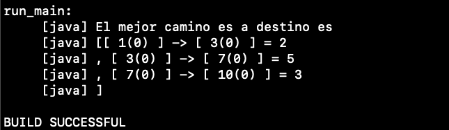
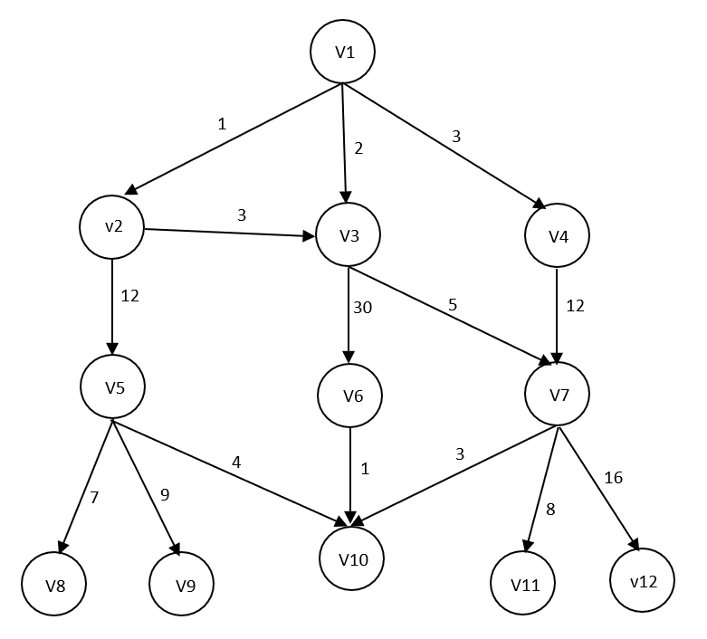

# Práctica 2 

Hecha por Maria Calvo Torres, Pedro Bereilh y Gonzalo Valdez Casis

## Como ejecutar el programa
Debemos tener instalado Apache Ant para comprobar si lo tenemos usar el comando:

````
ant -version 
`````

Para ejecutar la clase Main.java usar el comando:

````
ant run_main
````

> **_NOTA:_**  Ejecutar desde dentro de la carpeta java-algorithms-implementation.

Resultado tras ejecutar el comando anterior ir de v1 a v10:



## Grafo donde se genera el camnino 
- Queremos ir de v1 a v10 y usamos el algoritmo A*



## Preguntas sobre la práctica

**¿Qué variable representa la lista ABIERTA?**
- La variable openSet en la linea 44 de la clase Astar.java

**¿Qué variable representa la función g?**
- La variable gScore en la linea 48 de la clase Astar.java, la cual rellena sus datos en la linea 91

**¿Qué variable representa la función f?**
- La variable fScore en la linea 52 de la clase Astar.java, la cual rellena sus datos en la linea 54-55

**¿Qué método habría que modificar para que la heurística representara la distancia aérea entre vértices?**
- el metodo heuristicCostEstimate en la linea 119 de la clase Astar.java, por el momento devuelve 1 y no utiliza un calculo de distancias aéreas.

**¿Realiza este método reevaluación de nudos cuando se encuentra una nueva ruta a un determinado vértice? Justifique la respuesta.**
- Si, en la linea 96 se reevaluan todos los nudos del openSet ordenando el openSet para que el siguiente nudo a expandir sea el de menor fScore, se utiliza un comparador en la linea 62 que compara los fScore y devuelve valores que son utiles para la funcion sort.
